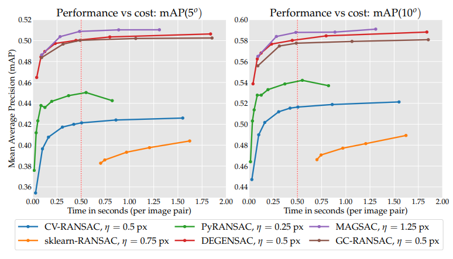

# This repository is moved to https://github.com/ducha-aiki/pydegensac

Due to name conflict with pypi package pyransac. Please, download/install https://github.com/ducha-aiki/pydegensac,
which is now available via pip wheels.


# pyransac


This repository contains an Python wrapper of RANSAC for homography and fundamental matrix estimation
from sparse correspondences. It implements [LO-RANSAC](https://link.springer.com/chapter/10.1007/978-3-540-45243-0_31) and [DEGENSAC](http://citeseerx.ist.psu.edu/viewdoc/download?doi=10.1.1.466.2719&rep=rep1&type=pdf).


# Performance

Vanilla pyransac implementation is marginally better than OpenCV one and with degeneracy-check enabled (DEGENSAC) it is the state of the art,
according to the recent study Yin et.al."[Image Matching across Wide Baselines: From Paper to Practice](https://arxiv.org/abs/2003.01587.pdf)", 2020.




# Installation

To build and install `pyransac`, clone or download this repository and then, from within the repository, run:

```bash
python3 ./setup.py install
```

or

```bash
pip3 install .
```

# Building hints from Tomasz Malisiewicz

1. Compiling pyransac without a system-wide install.

```bash
python3 ./setup.py build
```

2. Compiling on Mac OS X computer
Use GCC instead of Clang. The most recent version on my machine (installed via brew) is gcc-8. Try this:

```bash
CC=gcc-8 python3 ./setup.py build
```

3. Compiling on Ubuntu 18.04
You need LAPACK and a few other libraries and I always forget those specific package names. Take a look at my pyransac Dockerfile to see the exact packages you need to apt install on an Ubuntu 18.04 system (https://github.com/quantombone/pyransac-dockerfile/blob/master/Dockerfile)

```bash
FROM ubuntu:18.04
```

## update system
```bash
RUN apt-get clean
RUN apt-get update
RUN apt-get install -qy \
    git python3 python3-setuptools python3-dev
RUN apt-get install -y cmake libblas-dev liblapack-dev gfortran
RUN apt-get install -y g++ gcc
```

## download and build pyransac
```
RUN git clone https://github.com/ducha-aiki/pyransac.git
WORKDIR pyransac
RUN python3 ./setup.py build
```

## copy built assets into target directory (which will be a -v volume)
```docker
CMD cp -R /pyransac/build/lib.linux-x86_64-3.6/pyransac /target_directory
```

# dockerfile

https://github.com/quantombone/pyransac-dockerfile


# Example of usage

```python
import pyransac
H, mask = pyransac.findHomography(src_pts, dst_pts, 3.0)
F, mask = pyransac.findFundamentalMatrix(src_pts, dst_pts, 3.0)

```

See also this [notebook](examples/simple-example.ipynb) with simple example

And this [notebook](examples/how-to-use-detailed.ipynb) with detailed explanation of possible options


# Requirements

- Python 3
- CMake 2.8.12 or higher
- LAPACK, 
- BLAS (OpenBLAS, MKL, Atlas, ...)
- A modern compiler with C++11 support


## Citation

Please cite us if you use this code:

    @InProceedings{Chum2003,
    author="Chum, Ond{\v{r}}ej and Matas, Ji{\v{r}}{\'i} and Kittler, Josef",
    title="Locally Optimized RANSAC",
    booktitle="Pattern Recognition",
    year="2003",
    }
    
    @inproceedings{Chum2005,
    author = {Chum, Ondrej and Werner, Tomas and Matas, Jiri},
    title = {Two-View Geometry Estimation Unaffected by a Dominant Plane},
    booktitle = {CVPR},
    year = {2005},
    }
    
    @article{Mishkin2015MODS,
          title = "MODS: Fast and robust method for two-view matching ",
          journal = "Computer Vision and Image Understanding ",
          year = "2015",
          issn = "1077-3142",
          doi = "http://dx.doi.org/10.1016/j.cviu.2015.08.005",
          url = "http://www.sciencedirect.com/science/article/pii/S1077314215001800",
          author = "Dmytro Mishkin and Jiri Matas and Michal Perdoch"
    }
    


    
# Acknowledgements

This wrapper part is based on great [Benjamin Jack `python_cpp_example`](https://github.com/benjaminjack/python_cpp_example).
